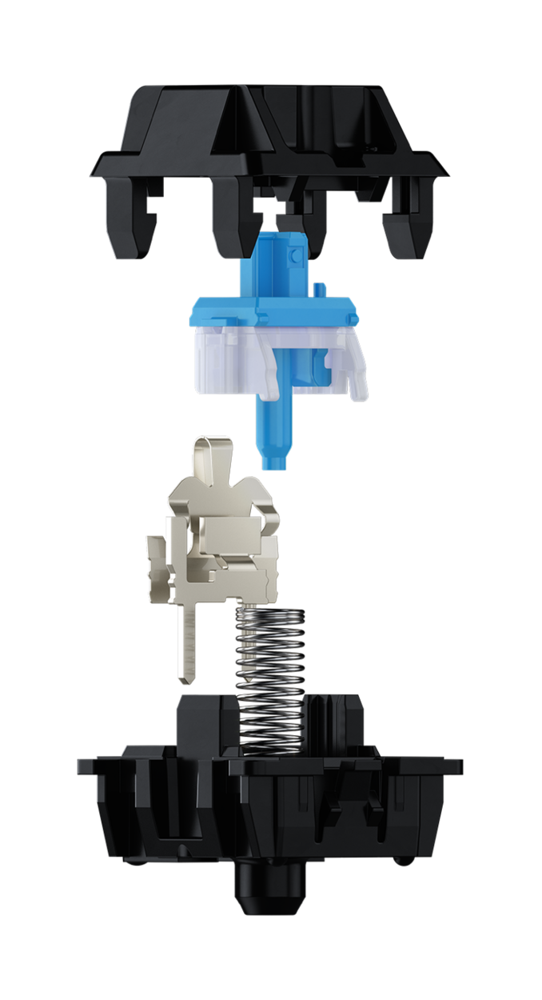

This ist a fork of [abstracthat/dactyl-manuform](https://github.com/abstracthat/dactyl-manuform) while this is a fork of [adereth/dactyl-keyboard](https://github.com/adereth/dactyl-keyboard)

I will simply describe all the steps I took to build this keyboard.

For any Information check out the original repos.

# Case

I decided myself for a 5x6 60% Layout and took the blueprint from the forked repositorie.


The pices got printed by [Brandl Computer](https://brandlcomputer.de/3d-druck/)

The printing is in progress. The results are comming soon

## Hot Swap Sockets

https://github.com/stingray127/handwirehotswap/tree/main/Matrix

# Switches [Cherry MX Blue](https://www.cherrymx.de/en/cherry-mx/mx-original/mx-blue.html)

CHERRY MX BLUE

The characteristic of this tactile switch is featured by tactile and audible feedback. Thanks to the striking "click", the CHERRY MX Blue not only provides noticeable, but also acoustic feedback. The switch with the CHERRY MX click technology is thus establishes itself as a courageous choice.

- Tactile and audible switching characteristics
- 60 cN operating force
- 2.2 mm pre travel
- 4.0 mm total travel
- With click

<details close>

 <summary>Switches</summary>

 

</details>

<details close>

 <summary>Mechanics</summary>


</details>

I highly recommend checking each switch with a multimeter, depending on how the keyboard is built there is no longer the possibility to change the switches!

# Keycaps

# Material List

## Tools

<details close>

 <summary>Soldering Iron</summary>

 

</details>

<details close>

 <summary>Soldering Wire</summary>

 

</details>

<details close>

 <summary>Flushcutters</summary>

 

</details>

<details close>

 <summary>Wire Strippers</summary>

 

</details>

<details close>

 <summary>Tweezers</summary>

 

</details>

## Components

| Components | Quantity
| :----------------: | :------
| [M3 Screws & Nuts]() | 10
| [Isolating Tape]() | 1
| [Arduino Pro Micro 5V ATMEGA32U4 16 Mhz](https://paradisetronic.com/en/arduino/pro-micro-module-atmega32u4-5v-16mhz-arduino-compatible) | 2
| [TRRS Jack](https://de.aliexpress.com/item/1005003763657242.html?spm=a2g0o.productlist.0.0.70b25feasvKbZ5&algo_pvid=36d94b92-7dff-4265-a678-00b574e233b7&aem_p4p_detail=202206170914193453435950843480003679084&algo_exp_id=36d94b92-7dff-4265-a678-00b574e233b7-9&pdp_ext_f=%7B%22sku_id%22%3A%2212000027083751167%22%7D&pdp_npi=2%40dis%21EUR%21%210.53%21%21%211.79%21%21%402100bdd516554824589573378e08c4%2112000027083751167%21sea) | 2
| [TRRS Cable](https://www.aliexpress.com/item/1005003278395267.html?spm=a2g0o.order_list.0.0.45eb5c5fqV8E9U) | 1
| [High Speed Silizium Diode Diotec 1N4148 150mA 75V 4ns 200°C](https://www.conrad.de/de/p/diotec-ultraschnelle-si-diode-1n4148-sod-27-75-v-150-ma-162280.html) | 100
| [Reset Switch](https://de.aliexpress.com/item/1005004001434474.html?spm=a2g0o.order_list.0.0.1d535c5fS50riU&gatewayAdapt=glo2deu) | 2
| [Micro USB to USB-C](https://www.aliexpress.com/item/1005002393327659.html?spm=a2g0o.order_list.0.0.383d5c5fEJYPPc) | 1
| [Wire](https://www.aliexpress.com/item/32825558073.html?spm=a2g0o.order_list.0.0.383d5c5fEJYPPc) | 20

# Building

## Wireing

# Flashing

[qmk](https://qmk.fm/)

[Online Configurator](https://config.qmk.fm/)

```
# installing qmk
if [[ "$(uname)" == "Darwin" ]]; then
    brew tap qmk/qmk
    brew install qmk
elif [[ "$(expr substr $(uname -s) 1 5)" == "Linux" ]]; then
    sudo pacm -S qmk
fi

# creating the firmware-repositorie
qmk setup
# git clone https://github.com/qmk/qmk_firmware

# copy the keymap
cp -r ~/repositories/dactyl-manuform/qmk_firmware/keyboards/handwired/dactyl_manuform/5x6/keymaps/custom ~/qmk_firmware/keyboard/handwired/dactyl-manuform/5x6/keymaps/custom

# navigate into firmware-directory
cd ~/qmk_firmware

# compile the firmware .hex file
qmk compile -kb handwired/dactyl_manuform/6x6 -km custom
```

- Plug the USB cable into the left half of the Dactyl.
- Push the hardware *reset* button.
- Run `qmk flash -kb handwired/dactyl_manuform/5x6 -km custom`
- Unplug the cable, and plug it into the right half. Follow the same instructions above.
- Unplug the cable, and plug it back into the left half. You’re done!

# Apendix

## Helpful Guides / Videos

<details close>

 <summary>nice build</summary>

https://arnmk.com/building-a-dactyl-manuform-with-hot-swappable-sockets/

</details>

<details close>

 <summary>Intro</summary>

https://www.youtube.com/watch?v=CxNKWNKBLMs

</details>

<details close>

 <summary>Time Lapse</summary>

https://www.youtube.com/watch?v=jImOY9Bgv74

</details>

<details close>

 <summary>Build Stream</summary>

[part 1](https://www.youtube.com/watch?v=dWC_8BOArzc)

[part 2](https://www.youtube.com/watch?v=fDc6rjZGYiI)

[part 3](https://www.youtube.com/watch?v=r-CKnaoSmCk)

[part 4](https://www.youtube.com/watch?v=Oloh3Yabu6I)

</details>

<details close>

 <summary>PCB Build</summary>

https://www.youtube.com/watch?v=Y57lNIpAdT4

</details>

# [Next Project](https://www.youtube.com/watch?v=MEuKa5OjU8g)

- https://bastardkb.com/open-source/

# License

Copyright © 2015-2017 Matthew Adereth and Tom Short

The source code for generating the models (everything excluding the [things/](things/) and [resources/](resources/) directories is distributed under the [GNU AFFERO GENERAL PUBLIC LICENSE Version 3](LICENSE).

The generated models and PCB designs are distributed under the [Creative Commons Attribution-NonCommercial-ShareAlike License Version 3.0](LICENSE-models).

